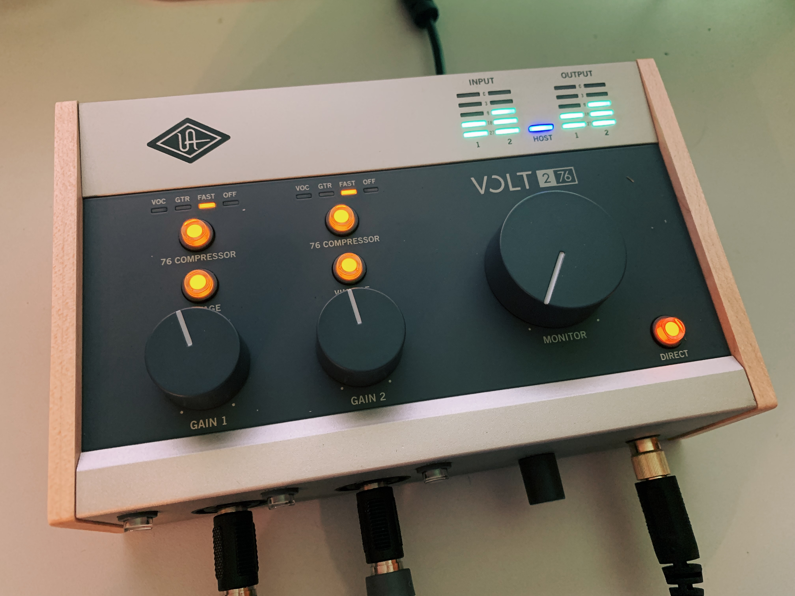

Finally, I get an audio interface. I am Djing since the late 90s and ~~making music~~ owning drum machines and synths for 15 years but I never feel the need for an audio interface. I have always been DAWless.

I want to learn how to record music and have projects that involved having a better recording solution.

## My approach to find the right model

### Requirements

Here are things I was looking for:
- **Something not pricey**: I wanted an entry-level one because I am a total noob about recording on a DAW and I need to learn
- **2 inputs**: To record at least one source in stereo
- **2 outputs**: To have one pair of monitors connected
- **Good software included**: [Abelton Live](https://www.ableton.com/en/live/) if possible because I want to learn how to use it.

### The choice (Universal Audio Volt 276)

After watching and reading reviews, my choice was the **[Universal Audio Volt 276](https://www.uaudio.com/audio-interfaces/volt-276-usb.html)**.

And there are big pluses to the requirements:
- **It is iOS compatible**. Perhaps I can use it with my phone to post jam snippets online. I have to try this.
- **It has a compressor !** The volt comes with a built-in compressor. This is huge ! 
- **It has a vintage mode**.

## Next steps

I need to learn how to use this device for my projects. I am looking forward to it.

After some tests, the sound is very good. The compressor and the vintage mode do an incredible job.

## How did I record before that

### Production

I recorded my production on my [Tascam DR-40x](https://www.tascam.eu/en/dr-40x) and posted them as it is on the Internet.

### Jam

The [Roland Go:Mixer Pro](https://www.roland.com/global/products/gomixer_pro/) is a great interface when you want to record directly on your phone. I am using it to record quick jam or snippets and post them on my Instagram or on Vimeo.

The micro-USB connection is bulky and the audio quality not top of the end but it does the job for recording music that will be listen on mobile phones most of the time.
