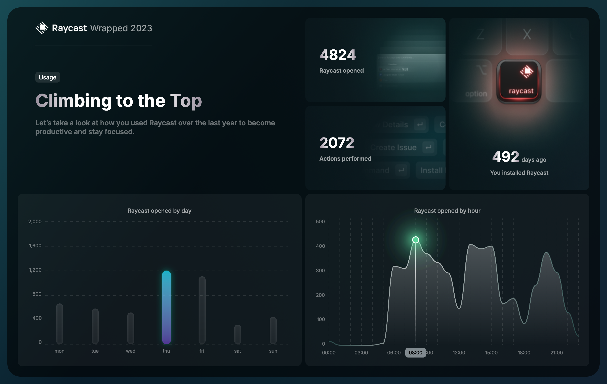
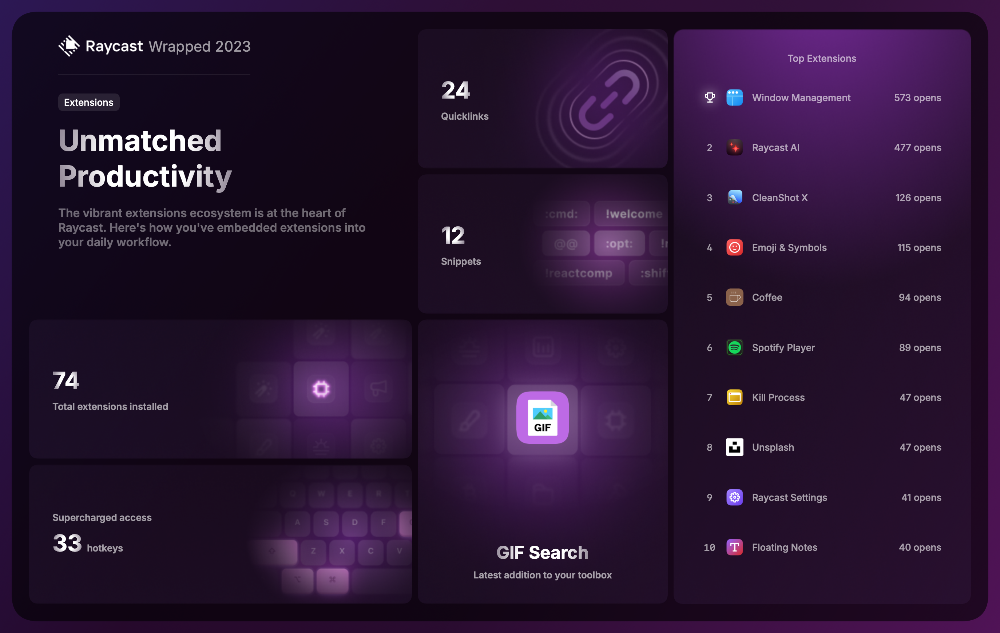
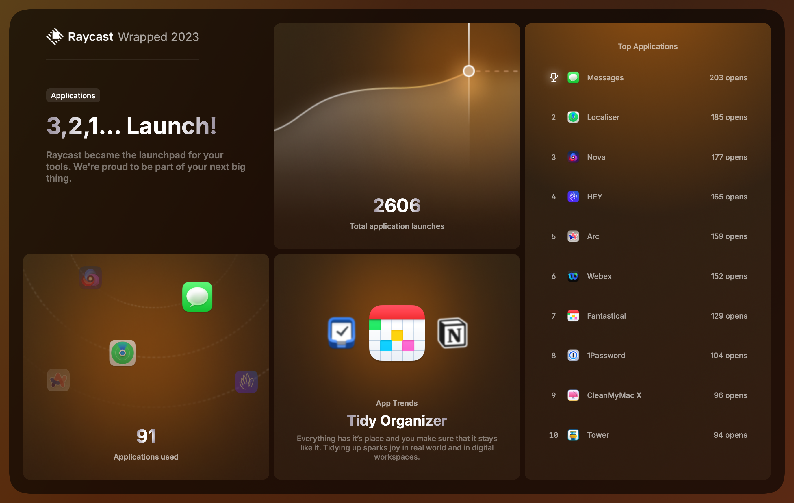

Raycast has a certain cost, and I'm still wondering if it's worth investing so much money in a tool.
I use this app daily. It has replaced Spotlight on all the Macs I work on.

The things I like and used the most are:
- **AI**: Primarily for spelling correction and translations
- **Clipboard History**
- **Floating Notes**: I love how it syncs quickly between different computers

For what it's worth, here are my statistics for 2023.

